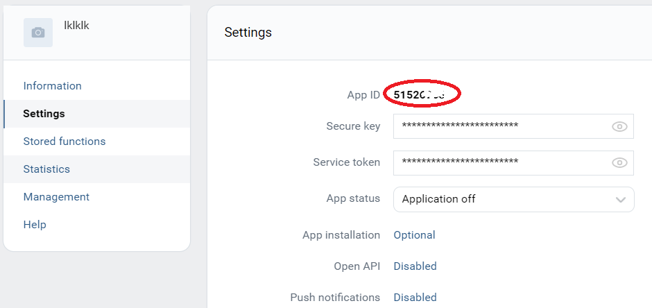

# Download photo albums from VK.

1. Create a standalone-application here: https://vk.com/apps?act=manage. Copy your App ID:

  

2. To get token follow the link using your App ID: https://oauth.vk.com/authorizeclient_id=YOUR_APP_ID&redirect_uri=https://oauth.vk.com/blank.html&callback&scope=30&display=mobile&response_type=token&v=5.89

3. Copy the string between `access_token=` and `&expires_in=`, it is your token

4. Run `main.py`

5. Note that your token expires in 24 h. After that, you'll have to create a new one using the link from step 2.
